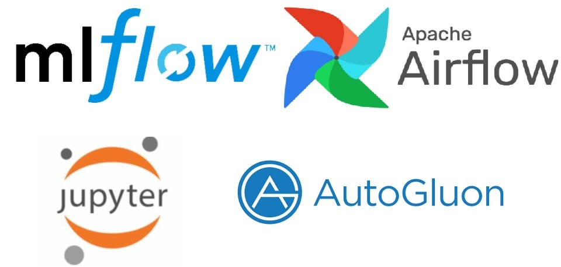

# MLOps + AutoMl approach to Stroke prediction

This a demo MLOps deployment for a model training and stream procesing using AutoGluon AutoMl, MlFlow and Airflow stack for a stroke prediction case of use. The process is orqhestrated using Apache Airflow with contains three DAGS:
- dags/stroke_insert_data.py: Represents the ETL process.
- dags/stroke_train_model.py: Trains a classification model form inserted data using AutGLuon AutoMl framewrok and updates model to MlFlow authomatically
- stroke_eval_data.py: Evaluates data isnertion on a batch process using best model updates to MlFlow.
Airflow instantiates AutoGLuoon during training process, trying a bunch of classification models and sticking to the best fit. Then, Airflow will take best fit and update it as an experimetn to a Mlflow bucket. 

## Stack Overview:

## Getting Started:

The arquitecture is ready to be deployed using docker and docker-compose. Before following next steps, make sure you have both technologies installed and ready to use. The ``docker-compose.yml`` file will build a [MLflow](https://mlflow.org) Tracking Server with [PostgeSQL](https://www.postgresql.org/) as the metadata store and [MinIO](https://min.io/) as the artifact repository. Note that MinIO is a standalone version of [Amazon S3](https://aws.amazon.com/s3/?nc1=h_ls). Moreover, a [NGINX](https://www.nginx.com/) server is used as a reversed proxy to secure the communications. An [AirFlow](http://airflow.apache.org) container will also be deployed which will use [PostgeSQL](https://www.postgresql.org/) as the metadata store too. Finally, a [Jupyter](https://jupyter.org/) instance will be deployed to check training results.

Follow these steps to build the MLflow Tracking Server:

1. Install docker (docker & docker-compose commands must be installed).
2. git clone
3. docker-compose up -d
4. Open MLfLow UI at http://your-docker-machine-ip:80
5. Open MinIO at at http://your-docker-machine-ip:9000
6. Open Airflow UI at http://your-docker-machine-ip:8080
7. Open JupyterLab UI at http://your-docker-machine-ip:1995
8. Within MinIO, create a new bucket named ``mlflow-bucket``
9. Enjoy!

## Starting Airflow DAGS:

## Tracking Models:

## Tracking traing metrics:

